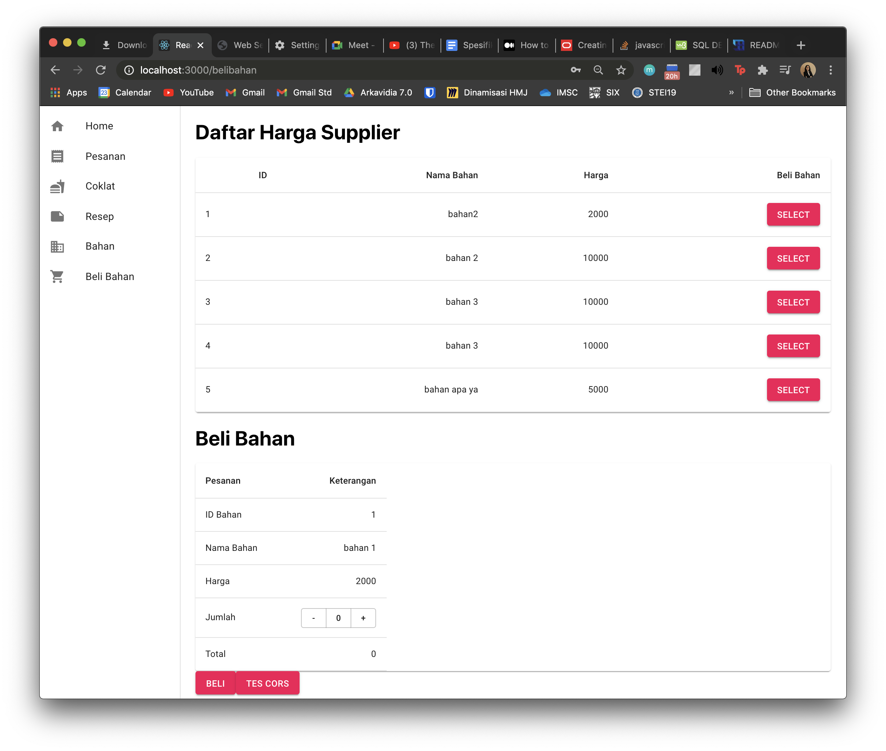

# Tugas 1 IF3110 Pengembangan Aplikasi Berbasis Web
# Aplikasi Web Factory (Factory Management Pro)

## Deskripsi SIngkat
Aplikasi Web Factory digunakan untuk melakukan manajemen pada pabrik coklat. Aplikasi ini merupakan antarmuka dan menggunakan ReactJs. Operasi yang tersedia sebagai berikut:
1. Login
2. Memberikan approval terhadap pesanan coklat dari WWWeb. Ketika pesanan diberikan approval, maka status pesanan akan diubah dari pending menjadi delivered. Setelah itu, Aplikasi akan mengirim permintaan ke WS-Factory untuk menambah stok coklat pabrik.
3. Melihat daftar pemesanan coklat dari WWWeb
4. Melihat daftar bahan yang tersedia di pabrik
5. Melihat daftar harga bahan yang tersedia di supplier
6. Membeli bahan dari supplier
7. Melihat daftar resep coklat
8. Melihat daftar coklat yang tersedia di pabrik
9. Melihat saldo pabrik

## Screenshot
Basis data yang digunakan adalah MySQL. Tabel pada MySQL berjumlah 1 yaitu bahan dengan atribut (id_bahan, nama_bahan, harga_satuan)

### Login Page

### Home Page

### Pesanan Page

### Coklat Page

### Resep Page

### Bahan Page

### Beli Bahan Page

## About

* 13518001 - Chandrika Azharyanti
* 13518027 - Jundullah
* 13518038 - Inka Anindya Riyadi
